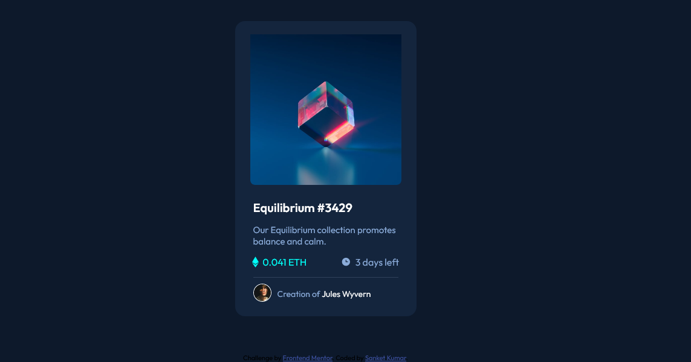

# Frontend Mentor - NFT preview card component solution

This is a solution to the [NFT preview card component challenge on Frontend Mentor](https://www.frontendmentor.io/challenges/nft-preview-card-component-SbdUL_w0U). Frontend Mentor challenges help you improve your coding skills by building realistic projects. 

## Table of contents

- [Overview](#overview)
  - [The challenge](#the-challenge)
  - [Screenshot](#screenshot)
  - [Links](#links)
- [My process](#my-process)
  - [Built with](#built-with)
  - [What I learned](#what-i-learned)
  - [Continued development](#continued-development)
- [Author](#author)
<!-- - [Acknowledgments](#acknowledgments) -->


## Overview

### The challenge

Users should be able to:

- View the optimal layout depending on their device's screen size
- See hover states for interactive elements

### Screenshot



### Links

- Solution URL: [(https://www.frontendmentor.io/challenges/nft-preview-card-component-SbdUL_w0U/hub/nftpreviewcardcomponent-using-mobile-first-workflow-and-css-flexbox-c1moN69UI](https://www.frontendmentor.io/challenges/nft-preview-card-component-SbdUL_w0U/hub/nftpreviewcardcomponent-using-mobile-first-workflow-and-css-flexbox-c1moN69UI)
- Live Site URL: [https://sanketcharanpahadi.github.io/nft-preview-card-component/](https://sanketcharanpahadi.github.io/nft-preview-card-component/)

## My process

### Built with

- Semantic HTML5 markup
- CSS custom properties
- Flexbox
- Mobile-first workflow

### What I learned

I learnt about responsiveness , css variables and mobile first workflow.

<!-- To see how you can add code snippets, see below:

```html
<h1>Some HTML code I'm proud of</h1>
```
```css
.proud-of-this-css {
  color: papayawhip;
}
```
```js
const proudOfThisFunc = () => {
  console.log('🎉')
} -->
<!-- ``` -->


### Continued development

I want to continue learning mobile first workflow and improving my css.


## Author

<!-- - Website - [sanket](https://www.your-site.com) -->
- Frontend Mentor - [@sanketcharanpahadi](https://www.frontendmentor.io/profile/sanketcharanpahadi)
<!-- - Twitter - [@yourusername](https://www.twitter.com/yourusername) -->


<!-- ## Acknowledgments

This is where you can give a hat tip to anyone who helped you out on this project. Perhaps you worked in a team or got some inspiration from someone else's solution. This is the perfect place to give them some credit. -->
